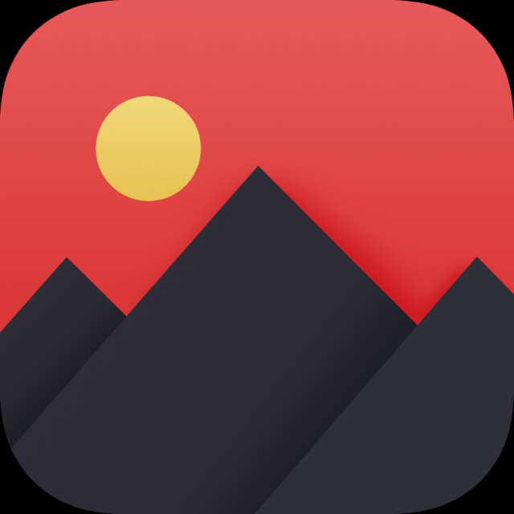

# MountainSearch

  
  

## Description

MountainSearch is a simple iOS app that allows a user to search through a number of famous Mountains and read basic details 
about them. The app uses a collection view with a search bar to allow a user to animate through their searches. The animations
are accomplished by taking advantage of diffable snapshots and diffable datasource, instead of the previously used `reloadData()`.
Although a UIKit app, SwiftUI is used to present the detail view.

MountainSearch uses a custom app icon created in this [Sketch project](https://github.com/mkKreations/MountainSearch_Sketch)! 

## Features

- Manages changes in collection view by taking snapshots using diffable datasource
- Uses custom compositional layout to create layout of items in collection view
- Detail screen is built using small, reusable View components produced using SwiftUI
- Manages `UISearchBar` and its state manually
- Light/Dark mode compatible

## App Icon

## Feedback

Any and all feedback is welcome - including pull requests.
